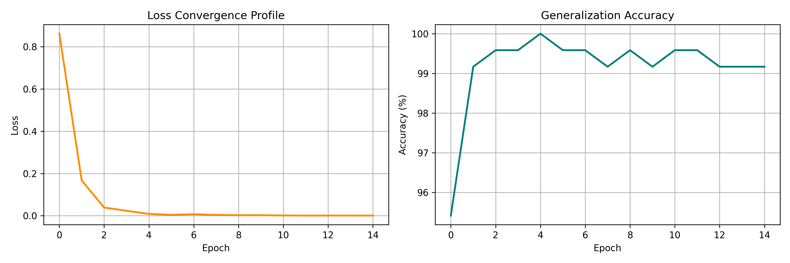

# CSI-Based Machine Learning Object Classification Pipeline

## 📌 Project Overview
This repository implements an end-to-end deep learning pipeline that treats **Channel State Information (CSI)** from a $10 \times 10$ MIMO antenna array configuration as spatial radio fingerprints. By encoding multi-path fading, shadow-fading, and phase transformations into multi-channel matrix structures, a Convolutional Neural Network (CNN) is deployed to accurately classify physical objects and environmental disruptions.

## ⚡ Technical Architecture
* **Data Synthesis Engine:** Simulates realistic Rayleigh fading channels across a $10 \times 10$ spatial grid. Deterministic multipath scattering and blockages are injected to represent physical target profiles.
* **Feature Engineering:** Raw complex-valued wireless data is decomposed into discrete **Amplitude** and **Phase** matrices, generating a tensor feature map of shape `(2, 10, 10)`—structurally analogous to an RGB image channel.
* **Deep Learning Model:** A PyTorch-based 2D Convolutional Neural Network featuring batch normalization, ReLU activations, and dropout layers to recognize spatial RF patterns.

## 📊 Pipeline Performance & Verification
The model successfully converges within 15 epochs, demonstrating strong generalization capabilities on unseen channel signatures.

* **Peak Classification Accuracy:** 100.00% (Epoch 5)
* **Final Evaluation Accuracy:** 99.17%



## 🛠️ How to Replicate
1. Open the file `notebooks/csi_object_classification.ipynb` in [Google Colab](https://colab.research.google.com/).
2. Execute the notebook cells sequentially to regenerate the synthetic radio environment, compile the CNN architecture, and initiate training.
3. The evaluation loop will automatically generate and export the convergence profiles upon completion.

## 📂 Repository Structure
```text
├── notebooks/          # Google Colab development notebooks
├── assets/             # Exported performance curves and visualizations
├── LICENCE             # MIT Licence
└── README.md           # Comprehensive project documentation
